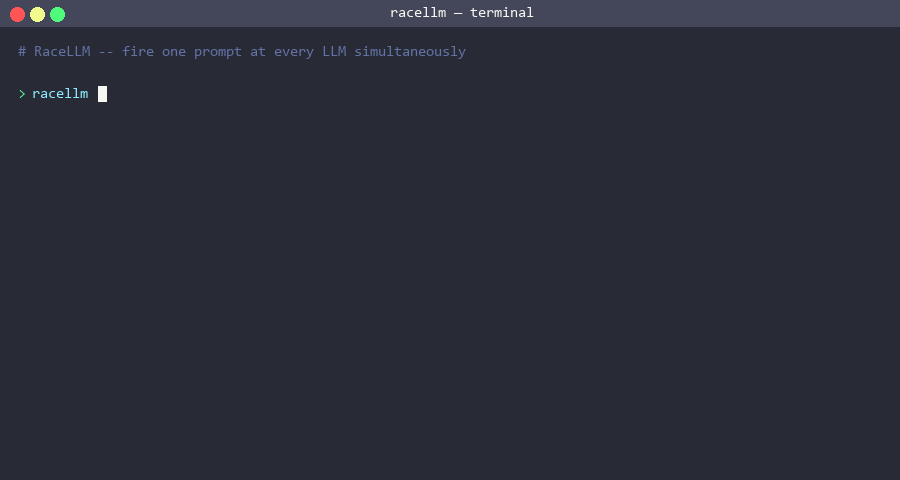

# RaceLLM 🏁

[](https://go.dev/)
[](LICENSE)
[](https://goreportcard.com/report/github.com/khuynh22/racellm)
[](https://pkg.go.dev/github.com/khuynh22/racellm)

> Race your LLMs — fire one prompt at multiple AI models simultaneously and see who finishes first.

RaceLLM is a high-concurrency Go CLI that sends your prompt to every configured model (OpenAI, Anthropic, Gemini, Ollama) at once, streams results in parallel, and renders a live BubbleTea dashboard showing each model racing to the finish line.



## Why?

- **Fan-Out Concurrency:** 1 prompt → N goroutines → N API calls simultaneously.
- **Streaming Aggregation:** Handles multiple incoming SSE token streams without blocking.
- **Live TUI Dashboard:** BubbleTea progress bars update in real-time as tokens stream in; winner is highlighted with timing stats the moment it finishes.
- **Graceful Cancellation:** `context.Context` kills losing connections the instant a winner is declared — saving API costs and CPU.
- **Works locally too:** Ollama support means you can race cloud models against local ones for free.

## Use Cases

| Who | What they do with RaceLLM |
|---|---|
| **Prompt engineers** | Validate a prompt across GPT-4o, Claude, and Gemini simultaneously before committing to one |
| **Cost-conscious teams** | Use `--mode fastest` to only pay for tokens up to the first complete response |
| **LLM researchers** | Race the same prompt across frontier models and record latency data empirically |
| **Developers** | Find which model is fastest for your specific workload before hard-coding a provider |
| **Go developers** | Study a real-world BubbleTea TUI + concurrent SSE fan-in architecture |

## Quick Start

```bash
# 1. Install
go install github.com/khuynh22/racellm@latest

# Or clone and build from source
git clone https://github.com/khuynh22/racellm.git
cd racellm && go build -o racellm .

# 2. Configure
cp racellm.example.yaml ~/.racellm.yaml
# Edit ~/.racellm.yaml with your API keys (or set env vars)

# 3. Race!
racellm "Explain goroutines in Go"
```

## Usage

```bash
# Race all configured models, wait for everyone
racellm "What is the meaning of life?"

# Race in fastest mode — cancel losers as soon as a winner finishes
racellm "Write a regex for email" --mode fastest

# Use a specific config file
racellm --config ./myconfig.yaml "Hello world"

# List configured models
racellm models

# Version
racellm version
```

## Configuration

Create `~/.racellm.yaml` (or `racellm.yaml` in the current directory):

```yaml
default_mode: all  # "fastest" or "all"

providers:
  openai:
    enabled: true
    api_key: "$OPENAI_API_KEY"   # resolves env var
    models:
      - gpt-4o
      - gpt-4o-mini

  anthropic:
    enabled: true
    api_key: "$ANTHROPIC_API_KEY"
    models:
      - claude-sonnet-4-20250514

  gemini:
    enabled: false
    api_key: "$GEMINI_API_KEY"
    models:
      - gemini-2.0-flash

  ollama:
    enabled: false
    models:
      - llama3
```

API keys prefixed with `$` are automatically resolved from environment variables.

### Key Components

| Component | Package | Responsibility |
|---|---|---|
| **Provider Interface** | `internal/provider` | Common contract for all AI backends |
| **OpenAI / Anthropic / Gemini / Ollama** | `internal/provider` | SSE stream parsing per API format |
| **Coordinator** | `internal/coordinator` | Fan-out goroutines, channel aggregation, cancellation |
| **Race Runner** | `internal/race` | Builds entrants from config, wires coordinator to TUI |
| **TUI** | `internal/tui` | BubbleTea live dashboard — progress bars, winner highlight, final scoreboard |
| **CLI** | `cmd` | Cobra-based command tree, flag parsing, signal handling |
| **Config** | `internal/config` | YAML loading, env var resolution |

### Concurrency Primitives Used

- **`sync.WaitGroup`** — wait for all racers to finish
- **`context.WithCancel`** — cancel losing goroutines in fastest mode
- **`chan Token`** — shared channel for streaming token fan-in
- **`chan RaceEvent`** — event bus from coordinator to UI layer
- **`sync.Mutex`** — protect shared result slice and winner flag
- **`signal.NotifyContext`** — graceful OS signal handling (Ctrl+C)

## Building

```bash
go build -o racellm .
```

## Cost & Rate Limits

Each race fires **N simultaneous API calls** — one per configured model. If you race 5 models, you're billed for 5 separate completions. In `fastest` mode the losers are canceled as soon as a winner finishes, so you only pay for the tokens streamed before cancellation.

Rate limits also apply per-model. If you race several models from the same provider, each counts separately toward that provider's quota.

## Troubleshooting

| Symptom | Likely Cause | Fix |
|---|---|---|
| `api_key is not set` | Env var not exported | Run `export OPENAI_API_KEY=sk-...` before racellm |
| `no providers enabled` | All `enabled: false` | Set `enabled: true` for at least one provider |
| Provider shows `ERR: API error (status 401)` | Wrong or expired API key | Regenerate and update your config / env var |
| Provider shows `ERR: API error (status 429)` | Rate limit hit | Wait and retry, or reduce concurrent models |
| Ollama times out | Model not pulled locally | Run `ollama pull <model>` first |
| TUI flickers | Terminal width too narrow | Widen your terminal to ≥ 100 columns |

## License

MIT

## Contributing

Contributions are welcome! Here's how to get started:

1. Fork the repo and create a feature branch: `git checkout -b feat/my-feature`
2. Run tests before and after your change: `go test -race ./...`
3. Keep code `gofmt`/`goimports` clean: `goimports -w .`
4. Run the linter: `golangci-lint run`
5. Open a PR describing what you changed and why.

**Adding a new provider?** See the [Adding a New Provider](https://github.com/khuynh22/racellm/blob/main/.github/copilot-instructions.md#adding-a-new-provider) section in the architecture notes.

## Citation

If you use RaceLLM in research or a project, please cite it:

```bibtex
@software{racellm,
  author  = {Khang Nguyen Huynh},
  title   = {RaceLLM: Race your LLMs from the terminal},
  url     = {https://github.com/khuynh22/racellm},
  license = {MIT},
}
```

GitHub also surfaces a **"Cite this repository"** button (top-right of the repo page) powered by the [`CITATION.cff`](CITATION.cff) file in this repo.
